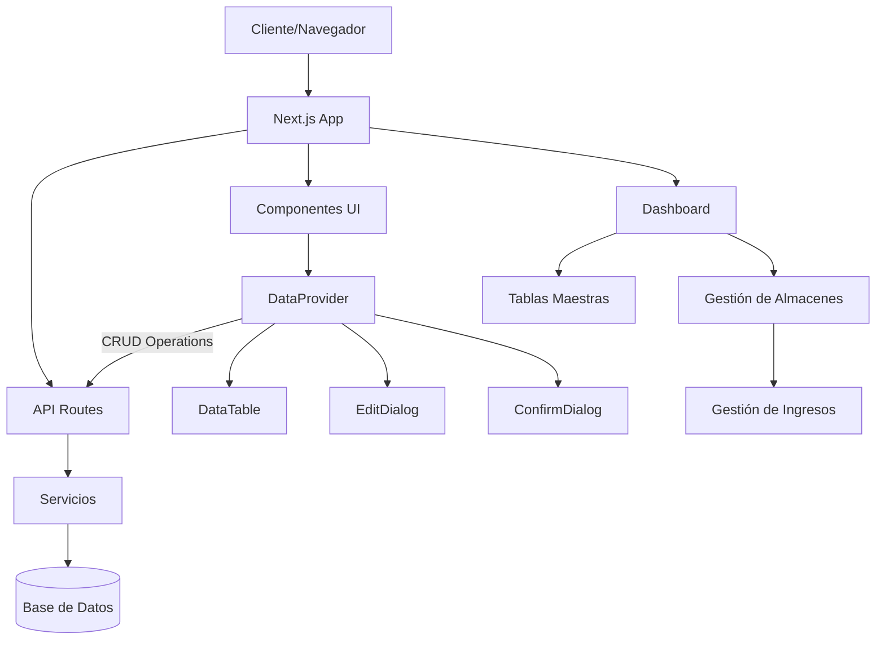

# Sistema de Farmacia - SIGSALUD

## Documentación de Análisis y Diseño

Este documento presenta el proceso de análisis y diseño inicial del Sistema de Farmacia SIGSALUD, una aplicación web desarrollada para la gestión integral de farmacias en entornos de salud.

## Tabla de Contenidos

- [Introducción](#introducción)
- [Especificaciones Funcionales](#especificaciones-funcionales)
- [Arquitectura del Sistema](#arquitectura-del-sistema)
- [Casos de Uso](#casos-de-uso)
- [Vistas de Interfaz de Usuario](#vistas-de-interfaz-de-usuario)
- [Modelo de Datos](#modelo-de-datos)
- [Tecnologías Utilizadas](#tecnologías-utilizadas)
- [Instalación y Configuración](#instalación-y-configuración)

## Introducción

El Sistema de Farmacia SIGSALUD es una aplicación moderna diseñada para optimizar la gestión de inventarios, ingresos, salidas y administración general de farmacias en entornos de salud. El sistema permite el control detallado de medicamentos, insumos médicos y procesos relacionados con la dispensación de productos farmacéuticos.

### Objetivos del Sistema

- Gestionar eficientemente el inventario de medicamentos e insumos médicos
- Controlar los procesos de ingreso y salida de productos
- Administrar información de proveedores, almacenes y consultorios
- Generar reportes detallados para la toma de decisiones
- Mejorar la atención al paciente mediante procesos optimizados

## Especificaciones Funcionales

### Módulos Principales

#### 1. Gestión de Almacenes

- **Descripción**: Administración de almacenes donde se guardan los productos farmacéuticos.
- **Funcionalidades**:
  - Creación, edición y eliminación de almacenes
  - Asignación de características (código, nombre, estado)
  - Visualización de inventario por almacén

#### 2. Gestión de Ingresos

- **Descripción**: Control de todos los ingresos de productos al sistema.
- **Funcionalidades**:
  - Registro de nuevos ingresos con fecha y monto
  - Asociación de ingresos a almacenes específicos
  - Seguimiento histórico de ingresos

#### 3. Tablas Maestras

- **Descripción**: Administración de catálogos y datos maestros del sistema.
- **Funcionalidades**:
  - Gestión de consultorios
  - Administración de especialidades
  - Configuración de tipos de productos
  - Gestión de clases de medicamentos

#### 4. Gestión de Usuarios y Permisos

- **Descripción**: Control de acceso y seguridad del sistema.
- **Funcionalidades**:
  - Creación y administración de usuarios
  - Asignación de roles y permisos
  - Registro de actividades (logs)

## Arquitectura del Sistema

El sistema está desarrollado siguiendo una arquitectura moderna basada en componentes, utilizando Next.js como framework principal.

### Diagrama de Arquitectura



### Patrones de Diseño

- **Patrón Repositorio**: Separación de la lógica de acceso a datos mediante servicios especializados
- **Componentes Reutilizables**: Desarrollo de componentes UI genéricos para maximizar la reutilización
- **Inyección de Dependencias**: Uso de servicios independientes que pueden ser inyectados donde se necesiten

## Casos de Uso

### CU-001: Gestión de Almacenes

**Actor Principal**: Administrador de Farmacia

**Flujo Principal**:
1. El usuario accede al módulo de Almacenes
2. El sistema muestra la lista de almacenes existentes
3. El usuario puede realizar las siguientes acciones:
   - Crear un nuevo almacén
   - Editar un almacén existente
   - Eliminar un almacén
   - Filtrar almacenes por estado (activo/inactivo)
   - Buscar almacenes por nombre o código

**Flujos Alternativos**:
- Si el usuario intenta eliminar un almacén con inventario asociado, el sistema muestra una advertencia
- Si el usuario intenta crear un almacén con un código ya existente, el sistema muestra un mensaje de error

### CU-002: Registro de Ingresos

**Actor Principal**: Operador de Farmacia

**Flujo Principal**:
1. El usuario accede al módulo de Ingresos
2. El sistema muestra la lista de ingresos existentes
3. El usuario selecciona "Nuevo Ingreso"
4. El sistema muestra un formulario para ingresar:
   - Almacén destino
   - Fecha de ingreso
   - Monto
   - Detalles adicionales
5. El usuario completa la información y guarda el registro
6. El sistema actualiza el inventario del almacén correspondiente

**Flujos Alternativos**:
- Si el usuario ingresa datos inválidos, el sistema muestra mensajes de validación
- Si ocurre un error en la actualización del inventario, el sistema revierte la transacción

### CU-003: Administración de Consultorios

**Actor Principal**: Administrador del Sistema

**Flujo Principal**:
1. El usuario accede al módulo de Tablas > Consultorios
2. El sistema muestra la lista de consultorios existentes
3. El usuario puede:
   - Crear un nuevo consultorio
   - Editar un consultorio existente
   - Eliminar un consultorio
   - Asignar especialidades a consultorios

**Flujos Alternativos**:
- Si el consultorio tiene citas o servicios asociados, el sistema advierte antes de permitir su eliminación

## Vistas de Interfaz de Usuario

### Dashboard Principal

El dashboard principal proporciona una vista general del sistema con acceso rápido a los módulos principales y estadísticas relevantes.

**Características**:
- Menú de navegación lateral
- Tarjetas de resumen con indicadores clave
- Accesos directos a funciones frecuentes

### Gestión de Tablas Maestras

Las interfaces de tablas maestras siguen un patrón común que incluye:

**Componentes**:
- Tabla de datos con paginación
- Filtros de búsqueda
- Botones de acción (Nuevo, Editar, Eliminar)
- Diálogos modales para formularios

### Formularios de Entrada

Los formularios del sistema están diseñados para ser intuitivos y validar la información en tiempo real.

**Características**:
- Validación instantánea
- Mensajes de error claros
- Campos obligatorios marcados
- Botones de acción contextual

## Modelo de Datos

### Entidades Principales

#### Almacén
- ALMACEN (PK): Código único del almacén
- NOMBRE: Nombre descriptivo
- ACTIVO: Estado del almacén (1=activo, 0=inactivo)

#### Ingreso
- INGRESOID (PK): Identificador único del ingreso
- ALMACEN (FK): Almacén al que se asocia el ingreso
- FECHA: Fecha del ingreso
- MONTO: Valor monetario del ingreso

#### Consultorio
- CONSULTORIO (PK): Código único del consultorio
- NOMBRE: Nombre descriptivo
- ABREVIATURA: Abreviatura del consultorio
- ESPECIALIDAD: Especialidad médica asociada
- TIPO: Tipo de consultorio
- ACTIVO: Estado del consultorio (1=activo, 0=inactivo)
- Otros campos de configuración

## Tecnologías Utilizadas

El sistema está desarrollado utilizando un stack tecnológico moderno:

- **Frontend**:
  - Next.js 15.1.0
  - React 18.2.0
  - TanStack Table para gestión de tablas
  - Radix UI para componentes de interfaz
  - Tailwind CSS para estilos

- **Backend**:
  - API Routes de Next.js
  - Prisma como ORM
  - Servicios especializados por entidad

- **Base de Datos**:
  - Compatible con múltiples motores (SQL Server, PostgreSQL)
  - Gestión mediante Prisma ORM

## Instalación y Configuración

### Requisitos Previos

- Node.js 18.x o superior
- NPM o PNPM
- Base de datos SQL Server o PostgreSQL

### Pasos de Instalación

1. Clonar el repositorio
   ```bash
   git clone <url-del-repositorio>
   cd Sistema-de-Farmacia-SIGSALUD
   ```

2. Instalar dependencias
   ```bash
   npm install
   # o
   pnpm install
   ```

3. Configurar variables de entorno
   ```
   # Crear archivo .env basado en .env.example
   cp .env.example .env
   # Editar con los valores correspondientes
   ```

4. Ejecutar migraciones de base de datos
   ```bash
   npx prisma migrate dev
   ```

5. Iniciar el servidor de desarrollo
   ```bash
   npm run dev
   # o
   pnpm dev
   ```

6. Acceder a la aplicación en http://localhost:3000

---

Desarrollado por el equipo de SIGSALUD © 2025
